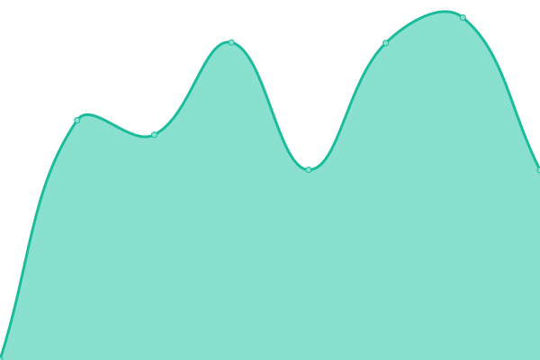

# [📈 Live Status](https://forsports.github.io/upptime): <!--live status--> **🟩 All systems operational**

This repository contains the open-source uptime monitor and status page for [ForSports](https://forsports.at), powered by [Upptime](https://github.com/upptime/upptime).

With [Upptime](https://upptime.js.org), you can get your own unlimited and free uptime monitor and status page, powered entirely by a GitHub repository. We use [Issues](https://github.com/forsports/upptime/issues) as incident reports, [Actions](https://github.com/forsports/upptime/actions) as uptime monitors, and [Pages](https://forsports.github.io/upptime) for the status page.

<!--start: status pages-->
<!-- This summary is generated by Upptime (https://github.com/upptime/upptime) -->
<!-- Do not edit this manually, your changes will be overwritten -->
<!-- prettier-ignore -->
| URL | Status | History | Response Time | Uptime |
| --- | ------ | ------- | ------------- | ------ |
|  [Portainer](https://portainer.forsports.eu/#!/auth) | 🟩 Up | [portainer.yml](https://github.com/forsports/upptime/commits/master/history/portainer.yml) | 

 730ms
     
 | 

<a href="https://status.forsports.at/history/portainer">99.48%</a>
    

|  [Drone Ci](https://ci.forsports.eu/) | 🟩 Up | [drone-ci.yml](https://github.com/forsports/upptime/commits/master/history/drone-ci.yml) | 

 556ms
     
 | 

<a href="https://status.forsports.at/history/drone-ci">99.50%</a>
    

|  [Forsports](https://forsports.at) | 🟩 Up | [forsports.yml](https://github.com/forsports/upptime/commits/master/history/forsports.yml) | 

 6680ms
     
 | 

<a href="https://status.forsports.at/history/forsports">99.51%</a>
    

|  [Forsports-qs API](https://api-qs.forsports.at/api/version) | 🟩 Up | [forsports-qs-api.yml](https://github.com/forsports/upptime/commits/master/history/forsports-qs-api.yml) | 

 695ms
     
 | 

<a href="https://status.forsports.at/history/forsports-qs-api">99.53%</a>
    

<!--end: status pages-->

[**Visit our status website →**](https://forsports.github.io/upptime)

## 📄 License

- Powered by: [Upptime](https://github.com/upptime/upptime)
- Code: [MIT](./LICENSE) © [ForSports](https://forsports.at)
- Data in the `./history` directory: [Open Database License](https://opendatacommons.org/licenses/odbl/1-0/)
